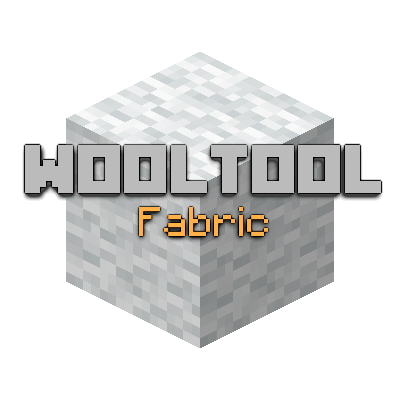

# WoolTool 🧶

## About

WoolTool is a Fabric mod for Minecraft 1.21.5 that adds new tools for working with wool and leather! Repair your leather armor, craft with wool more efficiently, and enjoy new crafting mechanics.

## Features

### Sewing Kit
- Repair damaged leather armor by 25% durability
- Use directly on leather armor or in crafting recipes
- Limited durability (8 uses)
- Requires leather for repairs

### Woolcard
- Essential tool for wool-related crafting
- Durable tool with 64 uses
- Enables efficient wool processing

### Additional Items
- **Needle**: Basic crafting component
- **Spool of Thread**: Used in sewing recipes

## Crafting

Crafting recipes for all new items are included in the mod. The Sewing Kit can be used in crafting recipes or directly on leather armor by right-clicking while holding it.

## Installation

1. Install [Fabric Loader](https://fabricmc.net/use/) and [Fabric API](https://www.curseforge.com/minecraft/mc-mods/fabric-api)
2. Download the latest version of WoolTool from [CurseForge](https://www.curseforge.com/) or [Modrinth](https://modrinth.com/)
3. Place the downloaded JAR file into your `mods` folder
4. Launch Minecraft and enjoy!

## Requirements

- Minecraft 1.21.5
- Fabric Loader ≥ 0.16.14
- Fabric API
- Java 21 or higher

## Compatibility

WoolTool is compatible with most Fabric mods. If you encounter any compatibility issues, please report them on our issue tracker.

## License

This mod is available under the CC0-1.0 License.

## Credits

- Created by Joel Trauger
- Thanks to the Fabric community for their amazing tools and support
- Special thanks to all the players who provide feedback and suggestions!

## Bugs & Suggestions

Found a bug or have a suggestion? Open an issue on our [GitHub repository](https://github.com/traugdor/WoolToolFabric) or contact us through [CurseForge](https://www.curseforge.com/).

---

  
  
  
  

"Crafting wool has never been so fun!"

